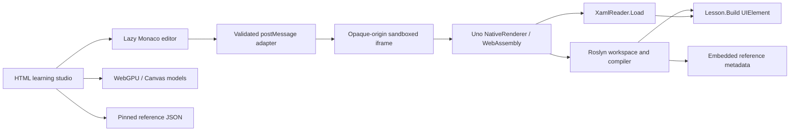

# Architecture

## Three deliberately separate systems

The course is an ES-module static site bundled with esbuild. It has no required application server, remote compiler, telemetry endpoint, or account backend. The browser downloads the large Uno/Roslyn runtime only when a learner starts a playground.

## Runtime

`runtime/LearnUnoRunner.csproj` uses a real `net10.0-browserwasm` inner build, Uno.Sdk, and BrowserEmbedded mode. `Program.cs` constructs the Application, Window, and preview surface. BrowserEmbedded generates `embedded.js`; the hosting HTML must execute it as a script so the bootstrapper can locate its own assets.

The project preserves reflection paths and embeds resolved reference assemblies as **culture-neutral resources**. `WithCulture="false"` is essential: otherwise names such as `System.Reflection.Metadata.dll` can accidentally be classified as satellite-resource inputs. The runtime’s reference corpus is used both by its Roslyn engine and the CI compiler checks.

`LanguageEngine` creates an AdhocWorkspace with C# feature services. Documents are updated through Roslyn’s immutable document model. Operations are serialized to avoid concurrent mutation of the single runtime surface. Compilation emits IL into memory and loads an assembly that contains `Lesson.Build()`. This is real C# execution, not a JavaScript interpreter of C# syntax.

Dynamically loaded lesson assemblies accumulate in this runtime configuration. The host limits runs and exposes a full-frame reset to release the instance. A reset is a lifecycle operation, not an attempt to unload one arbitrary assembly independently.

## Editor adapter

`editor.mjs` registers model-scoped Monaco providers and disposes them with the workspace. C# services are Roslyn-backed. XAML providers use `XamlSchema.Describe()` and XML parsing; they are not a replacement for the project XAML compiler. Version checks prevent an old diagnostics response from replacing a newer model’s markers.

The coach is deterministic. A lesson defines a focus anchor, progressive hints, a starter, a worked solution, and focused source checks. A successful run and a knowledge check record historical completion. These checks assist learning; they do not prove that every implementation or input is correct.

## Visual models

`visuals.mjs` implements WebGPU particle motion with a storage buffer, a compute dispatch, and an instanced render pass. Text and interaction remain accessible HTML. It limits resolution, stops animation for hidden views, honors motion preferences, and falls back when no device is available or the device is lost.

The models explain concepts. They are never passed off as actual Uno rendering, GPU profiling measurements, authentication, or production network behavior.

## State and routing

Fragment routes support GitHub Pages subpath hosting without rewrites. Progress, drafts, notes, bookmarks, and review due dates are versioned browser-local data. Import is validated against known lesson IDs and bounded text sizes; storage errors are surfaced rather than silently promising persistence.

The review schedule is explicit and local. It does not create notifications or background jobs.

## Reference corpus

`scripts/catalog.mjs` traverses every Markdown document physically present under the pinned repository’s `doc` directory. Documents are individually addressable by a deterministic path hash. The title/path/search index is separate from the complete Markdown bodies. Source, sample, and test paths form another index.

External DocFX repositories are not part of this checkout. The reader preserves raw Markdown and pinned source links when includes or specialized directives need the upstream rendering environment. The current search index contains a bounded text prefix per document; it is not a full-repository semantic search engine.

## Verification layers

1. Pure Node tests validate curriculum and local-state contracts.
2. A .NET console test compiles all authored C# starters and solutions against the same reference metadata as the browser.
3. Runtime smoke tests exercise the real sandbox, compiler, XAML loader, semantic completion, and schema.
4. Playwright executes all authored variants and representative user journeys against the published static output.
5. Public-site tests verify subpath, asset delivery, and the same representative journeys after deployment.

A test passing at one layer does not imply every layer passed. The workflow gates deployment on the required checks and retains concrete evidence.
