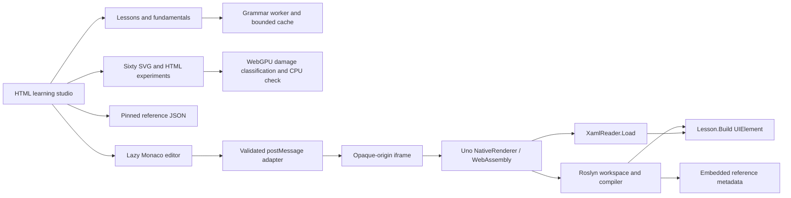

# Architecture

## Separate systems with explicit ownership

The course is a static ES-module site bundled with esbuild. It has no required application server, remote compiler, analytics service or account backend. Monaco and the substantial Uno/Roslyn runtime load on demand, not to display a colored reading example.

## Runtime and semantic services

`runtime/LearnUnoRunner.csproj` publishes a real `net10.0-browserwasm` inner build with Uno.Sdk and BrowserEmbedded mode. `Program.cs` initializes the renderer, Application, Window and preview surface. The embedding document executes `embedded.js` as a script so the bootstrapper can locate its assets. The build relocates generated package dependencies for repository-subpath hosting.

Resolved compiler reference assemblies are embedded as culture-neutral resources using `WithCulture="false"`. The browser Roslyn engine and CI compiler checks use the same metadata. Reflection and runtime-XAML paths are deliberately preserved; this playground has different trimming/download requirements from a small production app.

`LanguageEngine` owns an AdhocWorkspace and serializes operations on one preview instance. C# compilation emits IL in memory, loads an assembly and invokes `Lesson.Build()`. Runtime XAML uses `XamlReader.Load`; it does not run project generators or compile x:Bind, x:Class or code-behind handlers.

Dynamic lesson assemblies accumulate in this runtime configuration. A run limit and full-frame reset bound that lifetime. The frame has an opaque origin and separate ephemeral settings. It is not a hard CPU/memory quota; a non-returning loop can stall the tab.

`editor.mjs` registers model-scoped Monaco providers and disposes them with the workspace. C# completion, diagnostics, hover, local definitions, signatures and formatting use Roslyn. XAML suggestions use actual reflected Uno metadata and XML syntax checks, not a complete project XAML compiler. The deterministic coach provides focus anchors, hints and exercise checks; it is not a remote AI service or a semantic proof of mastery.

## Site-wide code coloring

`coloring/engine.mjs` bundles highlight.js and twenty selected grammar registrations, including the authored WGSL grammar. `coloring/worker.mjs` performs tokenization separately from the UI. Its cache and input limits are explicit; unsupported languages and oversized snippets remain complete plaintext.

`coloring/dom.mjs` observes code in lessons, fundamentals, reference documents, solution dialogs and changing model readouts. It excludes Monaco-owned content, preserves source text, rejects stale results and supports both changed source and language-only updates. A rendered language badge is output metadata, never an input that locks later inference to an old grammar. Worker failure/deadline handling leaves readable source and permits a fresh worker for later work.

Coloring is lexical and non-executing. It is not Roslyn semantic analysis. Theme variables style token spans without altering copied text; raw source is escaped before becoming markup.

## Lesson-specific visual atlas

The atlas contains sixty distinct explicit lesson assignments. Eleven established models retain stable URLs. Forty-nine additional models live in `atlas/lessons`, grouped by course path. Each supplies controls, a calculation, data, scene geometry, code, four phases, focus bounds and a declared teaching boundary. `labForLesson` rejects missing authoring instead of silently choosing a generic pipeline.

Shared SVG primitives supply consistency without supplying a generic explanation. `scenes.mjs` delegates to the appropriate authored model. Numerical readouts and connected code make results inspectable outside the SVG. Model tests verify changed-input outcomes, boundary calculations and one-to-one lesson ownership.

`atlas/playback.mjs` remains the authoritative seekable clock. It separates play intent from suspension reasons; stepping, input edits, speed changes, visibility, reduced motion and disposal have explicit behavior. The rendering adapter avoids rebuilding static geometry and resubmitting unchanged GPU input on every frame.

`atlas/gpu.mjs` performs real dirty-tile classification, renders the computed flags and checks readback against an independent CPU calculation. Requests are coalesced and revisioned. Device loss/unavailability preserves the SVG/HTML reference; it never labels a fallback as GPU execution. Readback is a teaching/validation aid, not a proposed production frame loop.

## Reading and local state

`learning/views.mjs` adds a mechanism/counterexample/investigation section to every lesson. `learning/guides.mjs` supplies twelve foundations chapters with original explanations, labelled fragments, recall feedback, transfer exercises and primary references. The guide scratchpad is explicitly transient; regular lesson notes retain their existing persistence semantics.

Fragment routes support GitHub Pages without rewrites. Atlas links carry bounded validated inputs, not executable source. Progress, drafts, notes, bookmarks and review dates are versioned browser-local data; existing lesson IDs remain stable. The review queue is local and does not create background notifications.

## Reference corpus and provenance

The catalog imports every Markdown file physically present under the pinned Uno repository's `doc` directory and retains per-document source links and raw Markdown. Source, sample and test paths are separately indexed. External DocFX repositories are not silently included. Search uses a bounded text prefix, not a claimed full-repository semantic index.

`build.json` records the deployed source commit, version, runtime presence and content counts. `sources.lock.json` separately pins upstream documentation; that snapshot is not a claim that every documented API is available in the chosen runner version.

## Validation

Node checks cover course/state contracts, every lesson assignment, model invariants, coloring safety and exact source preservation. Compiler checks compile the existing C# starters and solutions against actual runner metadata. Browser checks execute all 120 existing variants and test atlas routes, guide chapters, coloring, playback, keyboard interaction and responsive layouts. A separate software-WebGPU check establishes classification parity, not physical GPU performance.

The tested artifact is deployed only after required gates pass; public-site tests verify the actual Pages URL afterward. A passing unit test is not evidence that a browser, deployment or native-target check passed. See [lesson-specific-atlas.md](lesson-specific-atlas.md), [atlas-playback.md](atlas-playback.md), [graphics-validation.md](graphics-validation.md), and [security.md](security.md).
