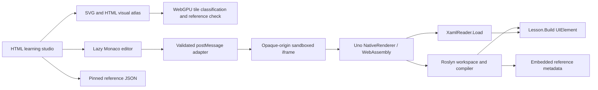

# Architecture

## Three deliberately separate systems

The course is an ES-module static site bundled with esbuild. It has no required application server, remote compiler, telemetry endpoint, or account backend. The browser downloads the large Uno/Roslyn runtime only when a learner starts a playground.

## Runtime

`runtime/LearnUnoRunner.csproj` uses a real `net10.0-browserwasm` inner build, Uno.Sdk, and BrowserEmbedded mode. `Program.cs` constructs the Application, Window, and preview surface. BrowserEmbedded generates `embedded.js`; the hosting HTML executes it as a script so the bootstrapper can locate its assets.

The project preserves reflection paths and embeds resolved reference assemblies as **culture-neutral resources**. `WithCulture="false"` prevents assembly names from being classified as satellite-resource inputs. The reference corpus is used both by the browser Roslyn engine and the CI compiler checks.

`LanguageEngine` creates an AdhocWorkspace with C# feature services. Documents are updated through Roslyn's immutable document model. Operations are serialized to avoid concurrent mutation of the single runtime surface. Compilation emits IL into memory and loads an assembly containing `Lesson.Build()`. This is C# execution, not a JavaScript interpretation of C# syntax.

Dynamically loaded lesson assemblies accumulate in this runtime configuration. The host limits runs and exposes a full-frame reset to release the instance. A reset is a lifecycle operation, not an attempt to unload one arbitrary assembly independently.

## Editor adapter

`editor.mjs` registers model-scoped Monaco providers and disposes them with the workspace. C# services are Roslyn-backed. XAML providers use `XamlSchema.Describe()` and XML parsing; they do not replace the project XAML compiler. Version checks prevent old diagnostics from replacing a newer model's markers.

The coach is deterministic. A lesson defines a focus anchor, progressive hints, a starter, a worked solution and focused source checks. A successful run and a knowledge check record historical completion. These checks assist learning; they do not prove every implementation or input is correct.

## Visual atlas

`atlas/catalog.mjs` describes eleven concept labs, controls, presets, lesson associations and scope statements. `atlas/models.mjs` contains their deterministic calculations. `atlas/scenes.mjs` generates inspectable SVG geometry and equivalent numerical/code readouts. `atlas/lab.mjs` owns interaction, focus, playback, sharing and disposal. The homepage is isolated in `atlas/home.mjs`; design styles are split into shell, lab and responsive layers.

The damage lab uses `atlas/gpu.mjs` for actual WebGPU classification. A compute pass writes tile flags to a storage buffer, an instanced render pass draws those flags, and readback verifies exact agreement with the CPU model. Requests are coalesced and revisioned; an old readback cannot overwrite the latest verification. Device loss or unavailable adapters preserve the SVG/HTML reference rather than pretending a fallback is GPU execution.

Playback is opt-in, stops on navigation, pauses while hidden/offscreen and honors reduced motion. Pointer manipulation has labelled control alternatives. Inputs in shared URLs are bounded and validated; shared links never execute code. The visual atlas models explain concepts and declare their simplifications. They are not actual Uno visual-tree traces, measured GPU timings, authentication implementations or production network behavior.

See [visual-edition.md](visual-edition.md) and [graphics-validation.md](graphics-validation.md) for the precise model and validation boundaries.

## State and routing

Fragment routes support GitHub Pages subpath hosting without rewrites. The atlas route optionally carries validated input JSON in its fragment query. Progress, drafts, notes, bookmarks and review due dates remain versioned browser-local data, unchanged by the redesign. Import is validated against known lesson IDs and bounded text sizes; storage failures are surfaced.

The review schedule is explicit and local. It does not create notifications or background jobs.

## Reference corpus

`scripts/catalog.mjs` traverses every Markdown document physically present under the pinned repository's `doc` directory. Documents are individually addressable by a deterministic path hash. The title/path/search index is separate from complete Markdown bodies. Source, sample and test paths form another index.

External DocFX repositories are not part of this checkout. The reader preserves raw Markdown and pinned source links when specialized directives need the upstream rendering environment. The search index contains a bounded text prefix per document; it is not a full-repository semantic search engine.

## Verification layers

1. Node tests validate curriculum, local-state contracts, model invariants and scene/input contracts.
2. A .NET console test compiles all authored C# starters and solutions against the same metadata as the browser.
3. Runtime smoke tests exercise the sandbox, compiler, XAML loader, semantic completion and reflected schema.
4. Playwright executes all authored variants and course/atlas journeys against the published output. A separate software-GPU test checks shader execution and CPU parity.
5. Public-site tests verify subpaths, asset delivery, real Uno interactions and the new atlas journeys after deployment.

A test passing at one layer does not imply every layer passed. Deployment is gated on the required checks and retains concrete evidence.
